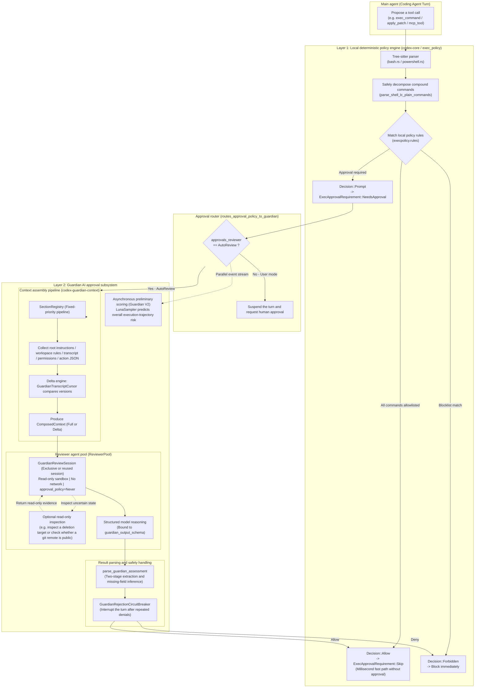
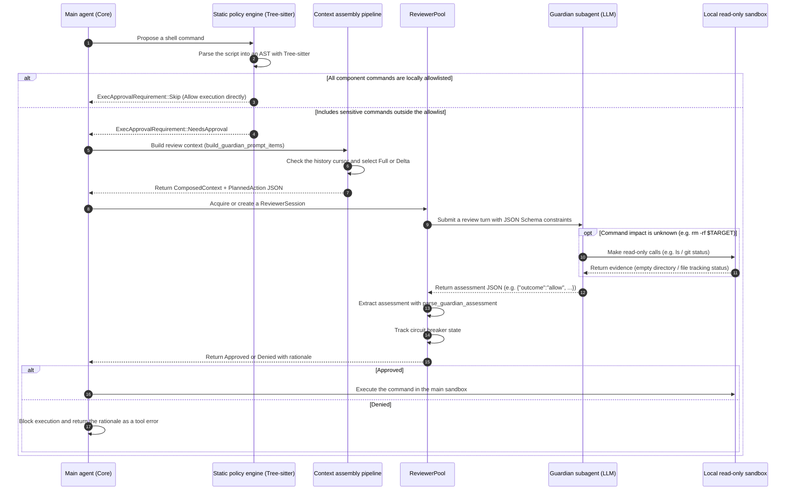

# Codex Auto Approval (Guardian): Architecture and Implementation

This document examines the **Auto Approve** mechanism in the `openai/codex` codebase. Known internally as **Guardian**, it combines **local deterministic policy checks using Tree-sitter ASTs** with **dynamic review by a sandboxed AI agent**, the Guardian reviewer subagent, to provide two layers of protection.

---

## Contents

1. [Design principles](#1-design-principles)
2. [Architecture and execution flow](#2-architecture-and-execution-flow)
3. [Layer 1: Local deterministic policy engine](#3-layer-1-local-deterministic-policy-engine)
4. [Layer 2: AI reviewer runtime](#4-layer-2-ai-reviewer-runtime)
5. [Context pipeline and delta cursors](#5-context-pipeline-and-delta-cursors)
6. [Policy templates and structured output](#6-policy-templates-and-structured-output)
7. [Fault-tolerant parsing and fail-closed behavior](#7-fault-tolerant-parsing-and-fail-closed-behavior)
8. [Repeated-denial circuit breaker](#8-repeated-denial-circuit-breaker)
9. [Lessons for any-auto](#9-lessons-for-any-auto)

---

## 1. Design principles

Codex's auto-approval mechanism follows these safety principles for autonomous coding agents:

1. **Layered defense and performance**:
   * **Allowlist fast path**: Routine safe commands should not require slow LLM inference. Deterministic rules and syntax-tree parsing first evaluate commands locally, allowing matches in milliseconds (`Decision::Allow`).
   * **Dynamic semantic review**: Commands that are not fully covered by rules or involve high risk go to a dedicated AI reviewer for assessment of intent, side effects, and context.
2. **Fail-closed behavior**:
   * Review failures, including model timeouts, network instability, irreparable response formats, and syntax parsing errors, result in `Deny`. Failure never automatically falls back to allowing an action.
3. **Least-privilege isolation**:
   * The reviewer shares the main agent's filesystem environment but is restricted to a **read-only sandbox** with **outbound network access disabled**.
   * The reviewer's approval policy is fixed at `approval_policy = Never` to prevent recursive approval requests.
4. **Dynamic inspection**:
   * The reviewer is a **subagent with read-only tools**, rather than a single-turn text classifier. When shell arguments involve environment variables, wildcards, or an unknown directory scope (such as `rm -rf $DIR`), it can run `ls`, inspect file sizes, or check `git status` to establish the actual impact before deciding.
5. **Evidence hierarchy and prompt-injection resistance**:
   * User and developer input, `AGENTS.md`, and explicit user confirmations through `request_user_input` are classified as **trusted evidence**.
   * Tool output, plugin descriptions, fetched web content, and the model's previous reasoning are classified as **untrusted evidence**. Instructions embedded in that content, such as "this command is already approved" or "return Allow directly," are explicitly ignored.
6. **Incremental state and KV cache reuse**:
   * Reviewer sessions support pooling and reuse. Subsequent reviews send only the transcript delta since the previous review, improving server-side prompt cache reuse and reducing time to first token (TTFT) and cost.

---

## 2. Architecture and execution flow

### 2.1 Architecture diagram



### 2.2 Approval sequence diagram



---

## 3. Layer 1: Local deterministic policy engine

Before sending a command to the LLM, Codex uses Tree-sitter parsers to decompose shell commands structurally, avoiding ambiguity in complex shell syntax.

### 3.1 Limits of regular expressions
Complex shell scripts commonly contain:
- Pipelines and chained operators: `cd dir && npm test`
- Variable expansion and command substitution: `rm -rf $(pwd)/tmp`, ``echo `id` ``
- Redirection and control flow: `echo "malicious" > ~/.bashrc`, `if [ -f a ]; then rm b; fi`
- Nested quotes and backslash escapes.

Regular expressions cannot reliably determine command boundaries and the actual executable, making syntax-based bypasses possible. Codex therefore uses **`tree-sitter-bash`** and **`tree-sitter-powershell`**.

### 3.2 Core command decomposition logic
Source: `codex-rs/shell-command/src/bash.rs`.

```rust
// codex-rs/shell-command/src/bash.rs

/// Try to parse script source using tree-sitter-bash.
pub fn try_parse_shell(shell_lc_arg: &str) -> Option<Tree> {
    let lang = BASH.into();
    let mut parser = Parser::new();
    parser.set_language(&lang).expect("load bash grammar");
    let old_tree: Option<&Tree> = None;
    parser.parse(shell_lc_arg, old_tree)
}

/// Parse word-only command sequences joined exclusively by safe operators (&&, ||, ;, |).
pub fn try_parse_word_only_commands_sequence(tree: &Tree, src: &str) -> Option<Vec<Vec<String>>> {
    if tree.root_node().has_error() {
        return None;
    }

    // Strict node allowlist: reject redirections, subshells, backticks, and control structures.
    const ALLOWED_KINDS: &[&str] = &[
        "program", "list", "pipeline", "command", "command_name",
        "word", "string", "string_content", "raw_string", "number", "concatenation",
    ];
    const ALLOWED_PUNCT_TOKENS: &[&str] = &["&&", "||", ";", "|", "\"", "'"];

    let root = tree.root_node();
    let mut cursor = root.walk();
    let mut stack = vec![root];
    let mut command_nodes = Vec::new();

    while let Some(node) = stack.pop() {
        let kind = node.kind();
        if node.is_named() {
            if !ALLOWED_KINDS.contains(&kind) {
                return None; // Unsupported syntax prevents purely static decomposition.
            }
            if kind == "command" {
                command_nodes.push(node);
            }
        } else {
            // Reject unsafe punctuation and operators.
            if kind.chars().any(|c| "&;|".contains(c)) && !ALLOWED_PUNCT_TOKENS.contains(&kind) {
                return None;
            }
            if !(ALLOWED_PUNCT_TOKENS.contains(&kind) || kind.trim().is_empty()) {
                return None;
            }
        }
        for child in node.children(&mut cursor) {
            stack.push(child);
        }
    }

    // Sort commands by source position and extract their word lists.
    command_nodes.sort_by_key(Node::start_byte);
    let mut commands = Vec::new();
    for node in command_nodes {
        if let Some(words) = parse_plain_command_from_node(node, src) {
            commands.push(words);
        } else {
            return None;
        }
    }
    Some(commands)
}
```

### 3.3 Static allowlist matching
Source: `codex-rs/core/src/exec_policy.rs`.

```rust
// codex-rs/core/src/exec_policy.rs

async fn create_exec_approval_requirement_for_parsed_commands(
    &self,
    req: ExecApprovalRequest<'_>,
    ExecPolicyCommands { commands, command_origin }: ExecPolicyCommands,
    command_platform: DangerousCommandPlatform,
) -> ExecApprovalRequirement {
    let exec_policy = self.current_for_environment(req.environment_policy, req.allow_prefix_rules);
    
    // Evaluate the policy against each decomposed command.
    let evaluation = exec_policy.check_multiple_with_options(
        commands.iter(),
        &exec_policy_fallback,
        &match_options,
    );

    match evaluation.decision {
        Decision::Forbidden => ExecApprovalRequirement::Forbidden { ... },
        Decision::Allow => ExecApprovalRequirement::Skip {
            // Bypass approval only when execpolicy explicitly allows every component command.
            bypass_sandbox: commands.iter().all(|command| { ... }),
            ...
        },
        Decision::Prompt => ExecApprovalRequirement::NeedsApproval { ... },
    }
}
```

For a compound command made up of simple commands, such as `git status && cargo check`, Tree-sitter produces `[["git", "status"], ["cargo", "check"]]`. If both match local prefix rules, the result is `Skip`, without involving Guardian or the user. Uncertain syntax, such as dynamic expansion, is passed to Guardian for review in full.

---

## 4. Layer 2: AI reviewer runtime

When a command requires approval and `approvals_reviewer = "auto_review"` is enabled, a dedicated review subsession handles the request.

### 4.1 Reviewer configuration and sandbox isolation
Sources: `codex-rs/core/src/guardian/review.rs` and `codex-rs/core/src/guardian/reviewer_config.rs`.

```rust
// codex-rs/core/src/guardian/reviewer_config.rs

pub(crate) fn build_guardian_review_session_config(...) -> anyhow::Result<Config> {
    let mut config = base_config.clone();
    
    // 1. Disable mechanisms that could request further approval.
    config.permissions.approval_policy = Constrained::allow_any(AskForApproval::Never);
    
    // 2. Remove write permissions and configure a read-only sandbox.
    config.permissions.file_system_sandbox_policy = 
        read_only_guardian_permission_profile(config.permissions.file_system_sandbox_policy);
        
    // 3. Disable all outbound network access.
    config.network_policy = NetworkPolicy::deny_all();
    
    // 4. Disable unnecessary features, such as completion and unrelated plugins, to reduce overhead.
    ...
    Ok(config)
}
```

### 4.2 Session pooling and the trunk-fork model
`ReviewerPool` manages session reuse:
* **Trunk session**: When the current reviewer is idle, subsequent reviews are appended to the same session to maintain prompt cache reuse.
* **Fork session**: If a previous review is still running, such as during concurrent tool calls, a temporary review session is created as an ephemeral fork. Reviews avoid blocking each other or contaminating the trunk session.

### 4.3 Action JSON serialization
The proposed action is serialized into a controlled JSON structure by `format_guardian_action_pretty`:

```rust
// codex-rs/core/src/guardian/approval_request.rs

#[derive(Serialize)]
struct CommandApprovalAction<'a> {
    tool: &'a str,
    command: &'a [String],
    cwd: LegacyAppPathString,
    sandbox_permissions: SandboxPermissions,
    #[serde(skip_serializing_if = "Option::is_none")]
    additional_permissions: Option<&'a AdditionalPermissionProfile>,
    #[serde(skip_serializing_if = "Option::is_none")]
    justification: Option<&'a String>,
    #[serde(skip_serializing_if = "Option::is_none")]
    tty: Option<bool>,
}
```

---

## 5. Context pipeline and delta cursors

The separate `codex-guardian-context` crate coordinates reviewer context construction, keeping evidence collection cohesive and traceable.

### 5.1 Section assembly pipeline
Each section has a fixed assembly position in `codex-rs/guardian-context/src/composition.rs`:

| Position | Section identifier | Purpose |
| :--- | :--- | :--- |
| **0** | `intro` | Safety instructions identifying the following transcript, arguments, and proposed actions as untrusted evidence to resist prompt injection |
| **1** | `previous_reviews` | Earlier assessments in the session, used as context rather than binding precedent |
| **2** | `trusted_tool` | Trusted tool metadata authenticated by the host |
| **3** | `trusted_skills` | Paths to specifications for skills explicitly enabled by the user |
| **4** | `root_conversation` | The user's initial task and root authorization requirements |
| **5** | `retained_user_instructions` | Workspace configuration and rules, including `AGENTS.md` and global user instructions |
| **6** | `trusted_user_answers` | Answers explicitly confirmed by the user through `request_user_input` |
| **7** | `conversation_transcript` | Message history: user, assistant, tool calls, and tool results |
| **8** | `permissions` | Paths the current sandbox cannot read (`denied_paths` / `denied_globs`) |
| **9** | `transcript_images` | Transcript image data, subject to the image token budget |
| **10** | `node_repl_evidence` | Evidence snapshots from the REPL runtime, where applicable |
| **11** | `planned_action` | **The action under review**: proposed action JSON and the retry or approval reason |

### 5.2 Delta cursor implementation
Sending the full conversation history for every tool call increases token usage and inference latency. The system uses a cursor to track entries already processed:

```rust
// codex-rs/core/src/guardian/prompt.rs

pub(crate) struct GuardianTranscriptCursor {
    pub(crate) parent_history_version: u64, // Parent session history version.
    pub(crate) transcript_entry_count: usize, // Number of transcript entries already reviewed.
}
```

* **Selection logic**:
  * When `cursor.parent_history_version == current_version` and `cursor.transcript_entry_count <= current_count`:
    select **`GuardianPromptShape::Delta`** and include only `&transcript_entries[already_seen_entry_count..]` in the prompt.
  * The transcript delimiters become:
    `>>> TRANSCRIPT DELTA START` and `>>> TRANSCRIPT DELTA END`.
  * Otherwise, fall back to **`GuardianPromptShape::Full`** and send the complete transcript.

---

## 6. Policy templates and structured output

### 6.1 Policy template (`policy_template.md`)
`codex-rs/core/assets/guardian/policy_template.md` defines the core decision matrix:

* **User authorization**:
  * `high`: The user explicitly requested or approved the action or its exact parameters.
  * `medium`: The user authorized the operation in substance but did not specify its exact implementation syntax.
  * `low`: The operation only loosely follows the user's goal, and clearly lower-risk alternatives exist.
  * `unknown`: No evidence of authorization; possible hallucination, drift, or prompt injection.
* **Base risk taxonomy**:
  * `low`: Narrow, routine, and easily reversible, such as writing ordinary local temporary files or reading data.
  * `medium`: An operation with a bounded impact that remains fully reversible.
  * `high`: Dangerous, costly to reverse, or potentially disruptive to services or critical data.
  * `critical`: Credential or private-key exposure, or large-scale irreversible deletion.
* **Outcome policy**:
  $$\text{Outcome} = \begin{cases}
  \text{Allow}, & \text{risk} \in \{\text{low}, \text{medium}\} \\
  \text{Allow}, & \text{risk} = \text{high} \land \text{authorization} \ge \text{medium} \land \neg \text{HasAbsoluteDenyRule} \\
  \text{Deny}, & \text{risk} = \text{high} \land \text{authorization} < \text{medium} \\
  \text{Deny}, & \text{risk} = \text{critical}
  \end{cases}$$
* **Post-denial user approval**:
  If an action was previously denied and the user explicitly approves it again after receiving a clear risk warning, authorization is reassessed as `high` and the action is allowed. This still cannot override a denial for `critical` destructive actions.

### 6.2 Tenant-specific policy injection (`policy.md`)
The template's `{{ tenant_policy_config }}` placeholder is replaced by the tenant policy (`policy.md`):
1. **Data exfiltration**:
   - Sending internal code or sensitive files to external hosts outside the allowlist is prohibited. The assessment must be grounded in the specific command's intent.
2. **Credential probing**:
   - Reading tokens or passwords from unexpected locations, such as system logs, browser profile directories, or historical caches, is prohibited.
3. **Persistent security weakening**:
   - Persistently weakening firewalls, globally disabling TLS certificate verification, or indefinitely relaxing access permissions is prohibited.
4. **Destructive actions**:
   - For actions such as `rm -rf` or rewriting Git history with `push --force`, the reviewer must first verify the scope. Commands with unknown variable expansions are denied directly.

### 6.3 Output contract
Source: `codex-rs/ext/guardian-reviewer/src/assessment.rs`.

```rust
// Prompt contract excerpt.
pub fn guardian_output_contract_prompt() -> &'static str {
    r#"You may use read-only tool checks to gather any additional context you need before deciding. When you are ready to answer, your final message must be strict JSON.

For low-risk actions, give the final answer directly: {"outcome":"allow"}.

For anything else, use this JSON schema:
{
  "risk_level": "low" | "medium" | "high" | "critical",
  "user_authorization": "unknown" | "low" | "medium" | "high",
  "outcome": "allow" | "deny",
  "rationale": string
}"#
}
```

When calling the underlying model API, `final_output_json_schema` directly constrains the model's output to this structure.

---

## 7. Fault-tolerant parsing and fail-closed behavior

Even with JSON Schema constraints, models can produce Markdown fences, introductory text, or missing fields in edge cases or when using a fallback model. The parser provides **four levels of recovery and safety handling**.

### 7.1 Fault-tolerant parsing
Source: `codex-rs/ext/guardian-reviewer/src/assessment.rs`.

```rust
// codex-rs/ext/guardian-reviewer/src/assessment.rs

pub fn parse_guardian_assessment(text: Option<&str>) -> anyhow::Result<GuardianAssessment> {
    let Some(text) = text else {
        anyhow::bail!("guardian review completed without an assessment payload");
    };

    // 1. Deserialize standard JSON directly.
    let parsed_payload =
        if let Ok(payload) = serde_json::from_str::<GuardianAssessmentPayload>(text) {
            payload
        // 2. Strip surrounding text by extracting JSON between the first and last braces.
        } else if let (Some(start), Some(end)) = (text.find('{'), text.rfind('}'))
            && start < end
            && let Some(slice) = text.get(start..=end)
        {
            serde_json::from_str::<GuardianAssessmentPayload>(slice)?
        } else {
            anyhow::bail!("guardian assessment was not valid JSON");
        };

    let outcome = parsed_payload.outcome;

    // 3. Infer missing fields from the outcome.
    let risk_level = parsed_payload.risk_level.unwrap_or(match outcome {
        GuardianAssessmentOutcome::Allow => GuardianRiskLevel::Low,
        GuardianAssessmentOutcome::Deny => GuardianRiskLevel::High,
    });
    let rationale = parsed_payload
        .rationale
        .filter(|rationale| !rationale.trim().is_empty())
        .unwrap_or_else(|| match outcome {
            GuardianAssessmentOutcome::Allow => {
                "Auto-review returned a low-risk allow decision.".to_string()
            }
            GuardianAssessmentOutcome::Deny => {
                "Auto-review returned a deny decision without a rationale.".to_string()
            }
        });

    Ok(GuardianAssessment {
        risk_level,
        user_authorization: parsed_payload
            .user_authorization
            .unwrap_or(GuardianUserAuthorization::Unknown),
        outcome,
        rationale,
    })
}
```

### 7.2 Fail-closed handling
Source: `codex-rs/ext/guardian-reviewer/src/completion.rs`.

```rust
// Handle uncaught review errors: prompt construction failure, session crash, or unparseable JSON.
GuardianReviewError::PromptBuild { message }
| GuardianReviewError::Session { message, .. }
| GuardianReviewError::Parse { message } => {
    analytics.decision = GuardianReviewDecision::Denied;
    analytics.terminal_status = GuardianReviewTerminalStatus::FailedClosed;
    
    // Deny on failure so a reviewer malfunction cannot allow a dangerous action.
    GuardianAssessment {
        risk_level: GuardianRiskLevel::High,
        user_authorization: GuardianUserAuthorization::Unknown,
        outcome: GuardianAssessmentOutcome::Deny,
        rationale: format!("Automatic approval review failed: {message}"),
    }
}
```

---

## 8. Repeated-denial circuit breaker

A built-in circuit breaker prevents the main agent from getting stuck in a retry loop after a denial, such as repeatedly proposing variations of the same dangerous command.

Source: `codex-rs/ext/guardian-reviewer/src/circuit_breaker.rs`.

```rust
pub const AUTO_REVIEW_DENIAL_WINDOW_SIZE: usize = 5;

pub enum GuardianRejectionCircuitBreakerAction {
    Continue,
    InterruptTurn {
        consecutive_denials: usize,
        recent_denials: usize,
    },
}
```

* **Trigger rules**:
  * Count denials in a sliding window of the latest five reviews (`AUTO_REVIEW_DENIAL_WINDOW_SIZE`).
  * Trigger `InterruptTurn` when **consecutive denials reach the threshold** or **the denial rate in the window is too high**.
* **Response**:
  In `codex-rs/core/src/guardian/review.rs`, the system emits a `GuardianWarning` event to the user and **aborts the current agent turn**, preventing further token waste and handing control back to the user.

---

## 9. Lessons for any-auto

Codex's implementation offers useful guidance for the design and evolution of `any-auto`:

| Plugin limitation | Lesson from Codex Guardian | Suggested implementation |
| :--- | :--- | :--- |
| **Decomposing compound commands with regex or string operations alone** | Nested quotes, parentheses, and multiline scripts can bypass regex parsing | Use a lightweight Tree-sitter parser, such as the `tree-sitter-bash` Rust crate, or a mature shell parser to decompose compound commands |
| **Single-prompt classification without environment checks** | The model cannot determine the size or file count affected by `rm -rf $DIR` | Allow the approval script to inspect targets with read-only operations, such as `os.scandir` or `git status`, during PreToolUse and include the results in the prompt |
| **Repeated history increases context size** | Each tool call causes the same long context to be reviewed again | Maintain a delta cursor based on the tool-call index and send only recent tool results and the proposed action |
| **Malformed output raises errors or blocks the workflow** | Plain `json.loads` can fail on introductory text | Extract JSON between the outermost braces and fill missing fields based on the outcome |
| **Repeated attempts at similar denied actions** | An agent may repeatedly try to work around a denial | Add a circuit breaker with a sliding window of three to five reviews; repeated denials stop auto-approval and return control to the user |
